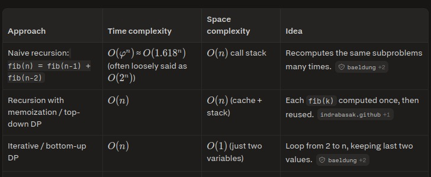

# Algoritmos_Avanzados

### Reference:
- Measuring Complexity of Fibonacci Algorithms (Memoization & Big O). (s. f.). https://velog.io/@devfish/Measuring-Complexity-of-Fibonacci-Algorithms-Memoization-Big-O

-Geeks for geeks. (2025, 27 agosto). Time complexity of recursive Fibonacci program. Geeks For Geeks. https://www.geeksforgeeks.org/dsa/time-complexity-recursive-fibonacci-program/

-Piwowarek, G., & Marshall, E. (s. f.). Computational complexity of Fibonacci sequence. Baeldung. https://www.baeldung.com/cs/fibonacci-computational-complexity